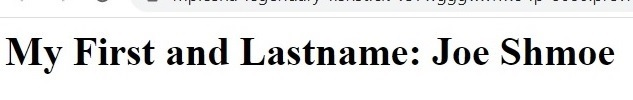

# Task on Terraform: Creating Docker Containers

The task involves writing a `main.tf` Terraform file that provisions two Docker containers. The first container should run an **Nginx** web server, and the second container should run a **MariaDB** database server.
## Nginx Container
The Nginx container is responsible for serving web content. It should be configured to return a response with the following text:
```
My First and Lastname: <Your first and lastname>
```
The screenshot as example:


## MariaDB Container
The MariaDB container should be configured to set the root password that we pass as a Terraform variable named `db_root_password` when running the `terraform apply` command. Here is an example:
```terraform
terraform apply -var="db_root_password=passexample"
```

## Terraform - Docker 

This Terraform project creates Docker containers for an **Nginx** web server and a **MariaDB** database server. This module uses the `kreuzwerker/docker` provider to spin up the containers.

### Modules

This project consists of two modules:

#### `nginx_container`

This module creates an Nginx container and an HTML file using a Terraform local file resource and provisioning the Docker image using the kreuzwerker/docker provider.

##### Required Variables

- `nginx_image`: The name of the Nginx Docker image.
- `nginx_version`: The version of Nginx Docker image used.
- `web_container_name`: The name to be assigned to the Nginx container.

#### `mariadb_container`

This module creates a MariaDB container and sets up a root password. 

##### Required Variables

- `mariadb_image`: The name of the MariaDB Docker image.
- `mariadb_version`: The version of the MariaDB Docker image used.
- `db_container_name`: The name to be assigned to the MariaDB container.
- `db_root_password`: The password be assigned to the root user of the MariaDB container.

### Outputs

No outputs
